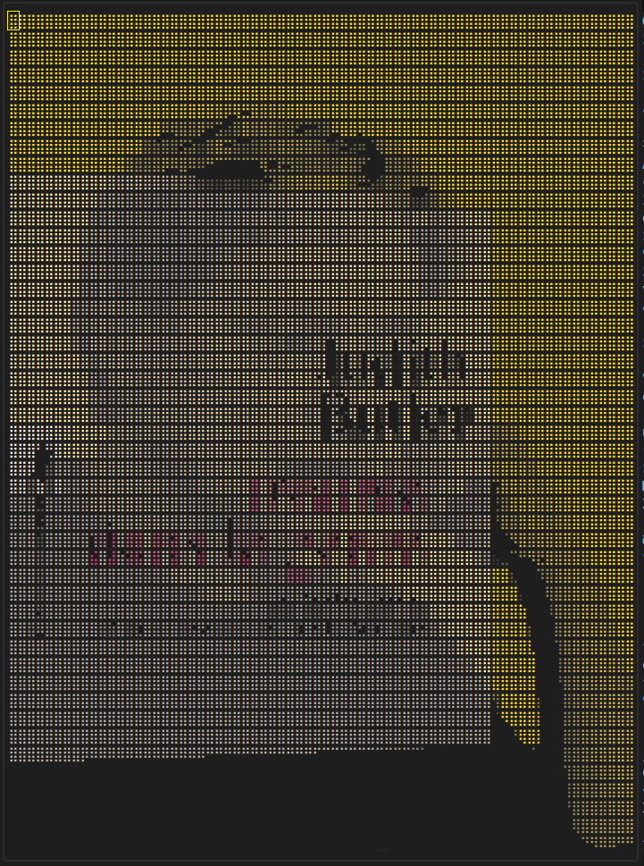

# ImagePreview

## Description

In all that follows, I am supposing that you're also using LunarVim with the LazyVim plugin manager.\
Installation procedures might vary depending on your architecture.


ImagePreview is a simple program that display preview of images in a neovim environnement.
If you're like me and you don't want to use Xterm, Kitty etc. (for whatever reason), you
can't really preview full blown images in your basic terminal.\
This is why I decided to create a program that could display ascii rendering of images.
As such, I'm fully conscious of the fact that it is what it is. The resolution depending
largely on the original image's details.

Its usage is pretty basic. Double-click or press enter on an image in your nvim-tree and the
preview will display itself. Clicking anywhere else the ascii rendering close the preview.

  \
*the original image and it's ascii version*

## Installation

To use ImagePreview, you will need several dependencies.\
First, you will need [ascii-image-converter](https://github.com/TheZoraiz/ascii-image-converter),
which you can get for example with snap (snap install ascii-image-converter) [see TheZoraiz repo for other way of installation].

Then, you'll also need two other dependencies, neovim plugins to be exact.
In your config.lua file, please add those plugins :
```lua
{ "ojroques/nvim-bufdel" }
{ "MunifTanjim/nui.nvim" }
```

Finally; to use ImagePreview, simply copy/paste the content of the init.lua file in your config.lua, and you should be good.
