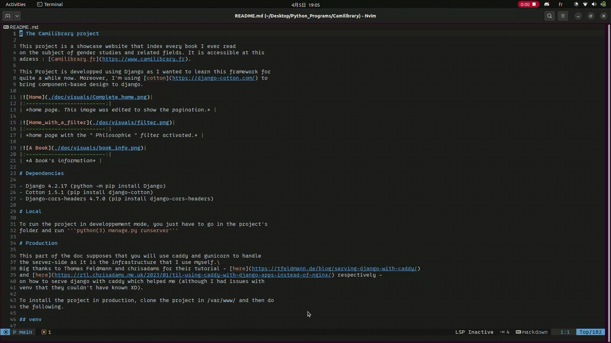

# ImagePreview

## Description

ImagePreview is a plugin that helps display preview of images in a neovim environnement.
If you're like me and you don't want to use Xterm, Kitty etc. for whatever reason, you
can't really preview full blown images in your basic terminal.\
This is why I decided to create a program that could display ascii rendering of images.
As such, I'm fully conscious of the fact that it is what it is. The resolution depending
largely on the original image's details.

The plugin is currently checking for .png, .jpg, .jpeg and .webp images.

## 📦 Installation

### Requirements

- Imagemagick (I used 6.9.11 but older versions should be good)
- Neovim >= 0.5.0
- [nvim-tree.lua](https://github.com/nvim-tree/nvim-tree.lua) (I should be using 1.11.0 but older versions should be good)
- [nui.nvim](https://github.com/MunifTanjim/nui.nvim)

### Supported distributions
While the plugin should theorically work on gnome-based distributions, I did not test it on other distro than Ubuntu 22.04.05\
If you're interested, don't hesitate to apply for a merge request to add your distro to the list of supported ones.

#### Gnome-Based Distributions
I suppose that you have a /etc/default/console-setup file that configure your ttys. This file must have those
lines, which describe the current font in use for them.
```shell
FONTFACE="\[FONT\]-\[TYPE\]"
FONTSIZE="8x[SIZE]"
```

⚠️ Beware : for this to work, I'm using the system-wide font. Please uncheck the "custom font" option in your gnome terminal
preferences. (Don't worry, the plugin revert back to the custom font when it's done).

### ⚙️ Configuration

#### [Lazy.nvim](https://github.com/folke/lazy.nvim)

```lua
{
    "Akutchi/ImagePreview",
    dependencies = { "MunifTanjim/nui.nvim" }    
}
```
To create the key binding, copy/paste this in your config.lua file, or wherever your config is :
##### Neovim
```lua
vim.keymap.set('n', '<leader>ip', require('imagepreview').Preview, { noremap = true, desc = "Preview an image" })
```
##### Lunarvim
```lua
lvim.builtin.which_key.mappings["i"] = {
  name = "Image",
  p = { "<cmd>lua require('imagepreview').Preview()<cr>", "Preview an image" }
}
```

## Usage

Its usage is pretty basic. First, open the tree explorer with \<leader>e, and place the cursor on
the image you want to preview. Then, use \<leader>ip to preview your image. Clicking anywhere else
the ascii rendering close the preview.


\<leader>e + \<leader>ip combination (please excuse the bad quality recording, will update later on.)

## Credits

This is my first neovim plugin. It was _hell_ to create, and as such, I'd like to thank some people
that helped me create my plugin (without them knowing, ofc). Those are,
- [m4xshen](https://m4xshen.dev/posts/develop-a-neovim-plugin-in-lua) for the general idea on how to create a 
local plugin.
- [D029](https://vi.stackexchange.com/a/46098) and
[Folke](https://www.reddit.com/r/neovim/comments/13rshwo/cant_get_lazynvim_to_load_local_dev_plugins_for/)
for understanding lua modules and the require function and how to add my local plugin to the lua path.
- [Gonçalo Alves](https://dev.to/iamgoncaloalves/how-i-developed-my-first-neovim-plugin-a-step-by-step-guide-1lcb)
for knowing how to locally reload my plugin using lazy.nvim.
- [TheZoraiz](https://github.com/TheZoraiz/ascii-image-converter) for their code which first allowed me to create
my plugin with an external dependency, and later on which code I partly took to port it from go to lua.
- In all of this fucking mess that is my browser history, to whomever got me the solution to change this fucking terminal
font family and size with gsetting.
- [Sunjon](https://github.com/sunjon/Shade.nvim/) which helped me understand that, in neovim, dimming is not done 
by actually dimming your font, but by creating an opaque overlay (there may be other methods tho).

